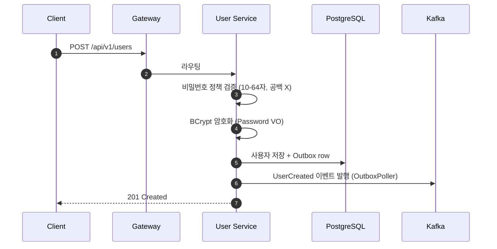
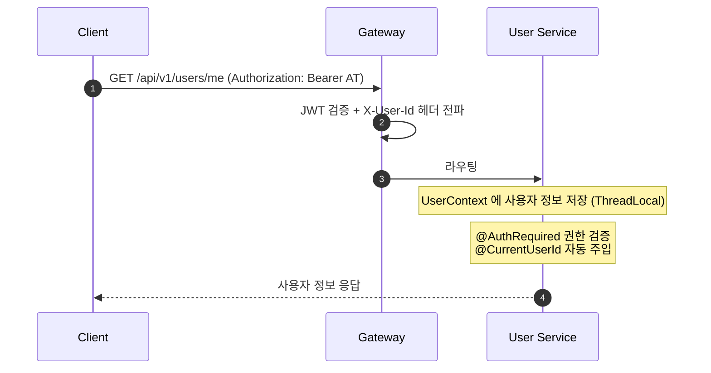
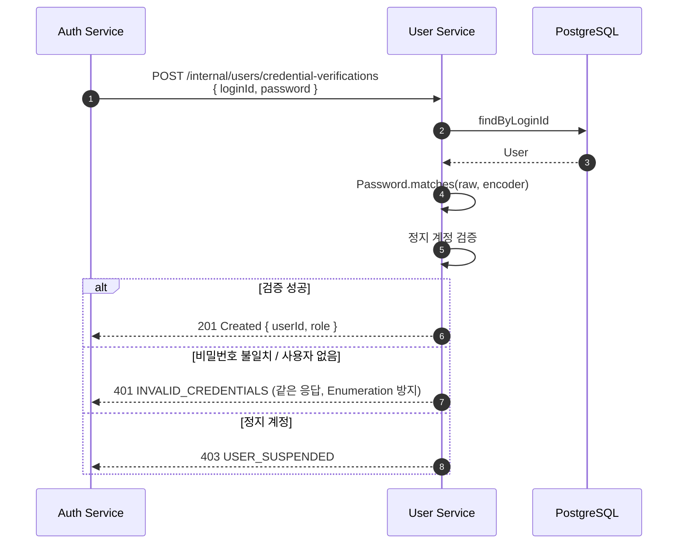

# Pagely — User Service

Pagely MSA 의 사용자 도메인 서비스. 회원 가입 / 정보 관리 / 권한 정책의 책임.

## 책임

- 사용자 가입 / 정보 조회 / 정보 수정
- 비밀번호 정책 (NIST 가이드 기반) + BCrypt 암호화
- 권한 (USER / MASTER) 기반 정보 수정 / 조회 정책
- 정지 계정 관리
- 내부 자격 검증 API 제공 (Auth Service Feign 호출 대응)
- 사용자 도메인 이벤트 발행 (Transactional Event + Outbox 패턴)

## 기술 스택

- Java 21, Spring Boot 3.5.13
- PostgreSQL 17 + Flyway
- Kafka (Outbox 이벤트 발행)
- Eureka / Config Server

## 사용자 시나리오

### 1. 회원가입



### 2. 사용자 정보 조회 / 수정



### 3. Auth Service 의 자격 검증 호출 (내부 API)



## 권한 정책

| 권한 | 가능한 작업 |
| --- | --- |
| `USER` | 본인 정보 조회 / 수정 |
| `MASTER` | 모든 사용자 조회 / 수정 / 정지 처리 |

`@AuthRequired(role = MASTER)` 어노테이션으로 선언적 적용.

## 비밀번호 정책

- 길이 10-64자
- 공백 금지
- 정책 검증은 `Password` VO 가 자체 수행
- 저장은 BCrypt 단방향 해시
- 검증은 `Password.matches(rawPassword, encoder)` 의 도메인 캡슐화

NIST SP 800-63B 가이드 참고.

## 도메인 이벤트

| 이벤트 | 발행 시점 | 구독 (예정) |
| --- | --- | --- |
| `UserCreated` | 회원가입 시 | Notification / AI 추천 |
| `UserSuspended` | 정지 처리 시 | Notification |
| `UserUpdated` | 정보 수정 시 | AI 추천 / 검색 인덱스 |

Outbox 패턴 적용. DB 트랜잭션과 함께 outbox row 저장 → `OutboxPoller` 가 주기적 polling 으로 Kafka 발행.

## 내부 API (Internal Endpoint)

내부 서비스 간 호출 전용. Gateway 가 `/internal/**` 외부 차단.

### POST /internal/users/credential-verifications

자격 검증 (Auth Service 의 로그인 흐름).

```bash
curl -X POST http://localhost:19001/internal/users/credential-verifications \
  -H "Content-Type: application/json" \
  -d '{ "loginId": "test_user", "password": "TestPassword!1" }'
```

응답:
- 성공: `201 Created { userId, role }`
- 비밀번호 불일치 / 사용자 없음: `401 INVALID_CREDENTIALS`
- 정지 계정: `403 USER_SUSPENDED`

### GET /internal/users/{userId}/user-info

권한 / 정지 상태 재조회 (Auth Service 의 토큰 갱신 흐름).

```bash
curl http://localhost:19001/internal/users/{userId}/user-info
```

응답: `{ userId, role }` 또는 `404 USER_NOT_FOUND` / `403 USER_SUSPENDED`.

## 패키지 구조

```
com.pagely.userservice/
├── domain/           — 핵심 비즈니스 로직 / 규칙
│   ├── model/          (User, Password VO, Role 등)
│   ├── event/payload/  (UserCreatedEvent 등)
│   ├── exception/      (UserErrorCode)
│   ├── service/        (PasswordEncoder 등 도메인 서비스)
│   └── repository/     (UserRepository 인터페이스)
├── application/      — 유스케이스 처리 / 흐름 제어
│   ├── service/        (UserApplicationService 등)
│   ├── dto/            (command / query / result)
│   └── port/           (외부 통신 인터페이스)
├── infrastructure/   — 외부 기술 / 상세 구현
│   ├── persistence/    (JPA Repository Adapter)
│   ├── messaging/      (Kafka Producer / Outbox)
│   ├── security/       (PasswordEncoder Adapter)
│   └── swagger/
└── presentation/     — 외부 노출
    ├── controller/     (UserController, InternalUserController)
    └── dto/            (request / response)
```

## 실행

### 사전 조건

- Java 21
- PostgreSQL 17
- Eureka / Config Server
- Kafka

### 기동

```bash
./gradlew bootRun
```

### 빌드 (Docker)

```bash
./gradlew bootBuildImage
docker run -p 19001:19001 \
  -e DB_URL=jdbc:postgresql://... \
  -e DB_USERNAME=... \
  -e DB_PASSWORD=... \
  -e KAFKA_BROKERS=... \
  pagely-user-service:latest
```

## 환경 변수

| 키 | 설명 |
| --- | --- |
| `DB_URL` | PostgreSQL 주소 |
| `DB_USERNAME` / `DB_PASSWORD` | DB 자격 |
| `KAFKA_BROKERS` | Kafka 브로커 |
| `EUREKA_SERVER_URL` | Eureka 주소 |
